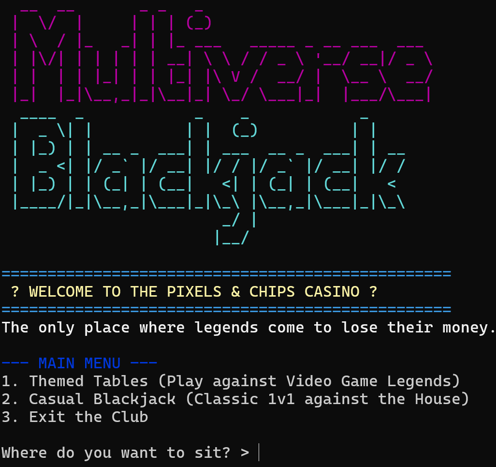
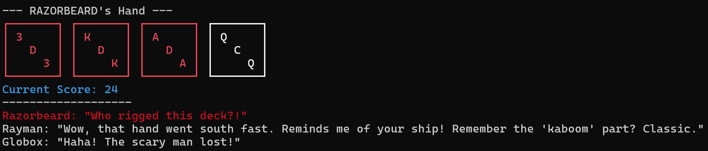

# 🃏 Multiverse Blackjack CLI

A modular, terminal-based Blackjack game built purely in Java. Step into a VIP Casino where you can play classic 1v1 against the Dealer, or sit at themed tables alongside legendary video game characters with their own AI, betting styles, and dynamic dialogues.

## 🚀 How to Run

### Prerequisites
* **Java JDK 23** installed on your system.

This project is a CLI (Command Line Interface) game. The easiest way to play is using the pre-packaged release.
No compilation required! To play, follow these steps:

1. Go to the **Releases** section on the right side of this GitHub repository (or click the "Latest" tag).
2. Download the `MultiverseBlackjack-v1.0.zip` file.
3. Extract the downloaded `.zip` file into a folder on your computer.
4. Double-click the `play.bat` file to launch the VIP Casino and start playing.

*(Note: Requires Java installed on your system).*

## 🎮 How to Play

* Choose a game mode from the Main Menu (Themed Tables or Classic Casual).
* Place your bets using your initial balance of 500 chips.
* Choose to **(H)**it, **(S)**tand, or **(D)**ouble Down.
* Watch the NPCs play their turns and react to the unfolding game.
* Survive until you clear the table or go bankrupt!

## ✨ Features

* **Themed Tables:** Play against iconic characters from different gaming universes.
* **Dynamic NPC Interactions:** Characters react in real-time to your wins, losses, and busts using randomized dialogue arrays. They even interact with each other!
* **Advanced OOP Architecture:** Built with clean code principles, utilizing Inheritance, Polymorphism, and Encapsulation. Easily scalable to add new franchises with zero friction.
* **Classic Game Mechanics:** Features standard Blackjack rules, including dynamic betting, card drawing, dealer AI (hits until 17), and the **Double Down** mechanic.
* **ASCII Visuals:** Custom console rendering for cards and suits using ANSI escape codes for a vibrant terminal experience.

## 🏗️ Project Structure

The codebase is organized into logical packages for maximum scalability:
* `core/`: Contains the main game loop, display manager, deck generation, and table management.
* `entities/`: Base abstract classes (`Boss`, `Player`) defining core mechanics.
* `entities.residentevil/` & `entities.rayman/`: Sub-packages containing specific NPC logic, betting behaviors, and tailored dialogue lines.

---
*Developed as a showcase of Object-Oriented Programming and modular design in Java.*